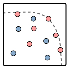

# MATLAB Figures from Published Papers

MATLAB scripts generating figures from peer-reviewed publications. Each file corresponds to a specific paper and contains all plotting code for its figures. 

## License
MIT Licensed - See [LICENSE](LICENSE)

## Repository Contents
Each MATLAB script contains all figure generation code for its corresponding publication:

### [`TPEL_2025_3569420.m`](TPEL_2025_3569420.m)
* H. Wouters and W. Martinez, "Integrated Inductor-Transformers for High-Frequency Converters: An Overview," in IEEE Transactions on Power Electronics
* doi: [10.1109/TPEL.2025.3569420](https://doi.org/10.1109/TPEL.2025.3569420)

### [`APEC48143_2025_10977235.m`](APEC48143_2025_10977235.m)
* H. Wouters, W. -R. Lin, N. Pirson, T. Jochmans, Y. Zuo and W. Martinez, "PCB-Winding Integrated Transformer for 800-V Dual Active Bridge Converter using 1.2-kV GaN Devices," 2025 IEEE Applied Power Electronics Conference and Exposition (APEC), Atlanta, GA, USA, 2025, pp. 258-265
* doi: [10.1109/APEC48143.2025.10977235](https://doi.org/10.1109/APEC48143.2025.10977235)

### [`APEC48139_2024_10509410.m`](APEC48139_2024_10509410.m)
* H. Wouters, H. Pervaiz, T. Geboers, Y. Zuo, W.-R. Lin and W. Martinez, "Interleaved PCB Winding Planar Transformer for Electric Vehicle Charging CLLC Converters," 2024 IEEE Applied Power Electronics Conference and Exposition (APEC), Long Beach, CA, USA, 2024, pp. 3216-3223
* doi: [10.1109/APEC48139.2024.10509410](https://doi.org/10.1109/APEC48139.2024.10509410)

### [`TPEL_2023_3319996.m`](TPEL_2023_3319996.m)
* H. Wouters and W. Martinez, "Bidirectional Onboard Chargers for Electric Vehicles: State-of-the-Art and Future Trends," in IEEE Transactions on Power Electronics, vol. 39, no. 1, pp. 693-716, Jan. 2024
* doi: [10.1109/TPEL.2023.3319996](https://doi.org/10.1109/TPEL.2023.3319996)

## Key Features
- One `.m` file per publication
- Regenerate figures from papers
- Note that final figures are post-processed in Adobe Illustrator (vector format)
- Formats optimized for publication in double-column IEEE templates

## Usage
1. Clone repository
2. Open specific paper's `.m` file in MATLAB
3. Run script to generate all figures, optionally enable the export lines

## Additional Resources
- IEEE Xplore profile: [https://ieeexplore.ieee.org/author/37089569987](https://ieeexplore.ieee.org/author/37089569987)
- ResearchGate: [https://www.researchgate.net/profile/hans-wouters-5](https://www.researchgate.net/profile/hans-wouters-5)

## Notes
- These scripts are shared for research transparency and appreciation of scientific visualization :)
- While reasonably documented, please note they were typically developed under publication deadlines.
- MATLAB R2021b or newer recommended for best compatibility.